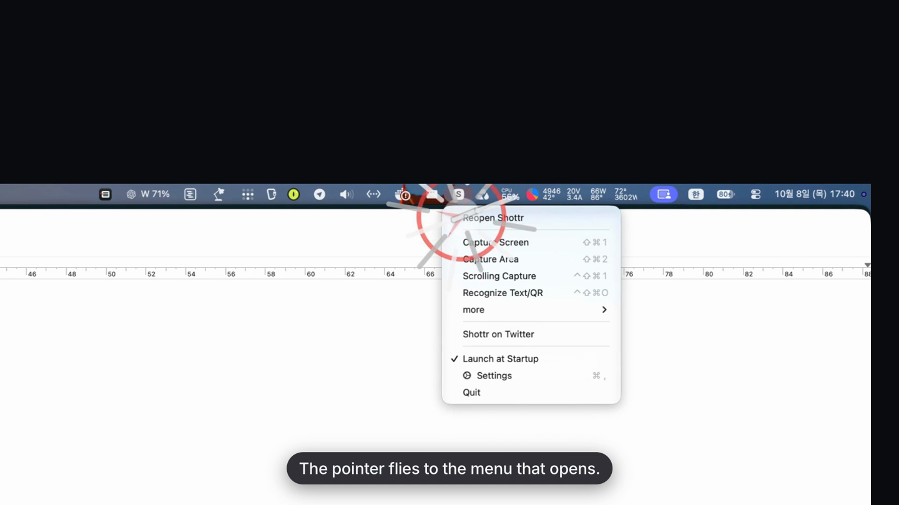
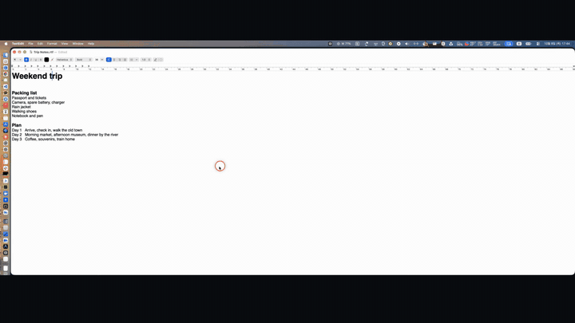
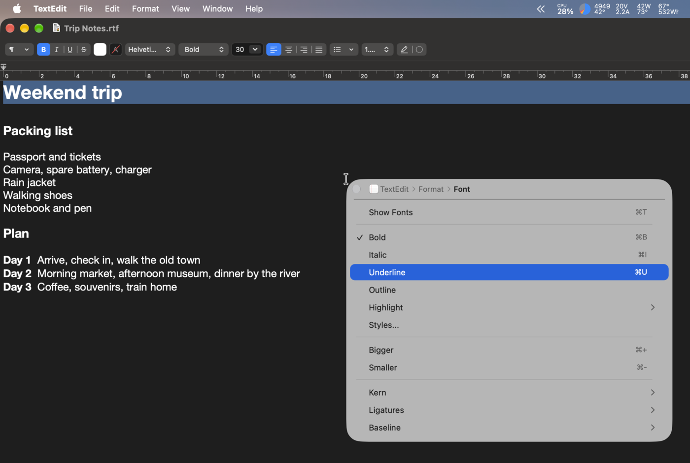
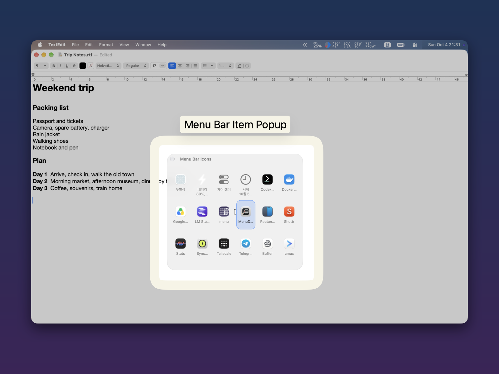
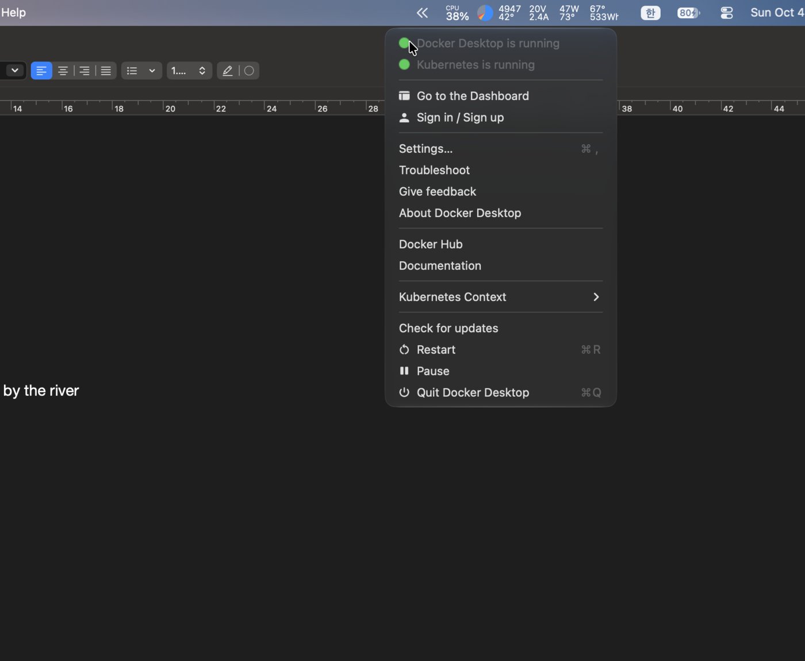
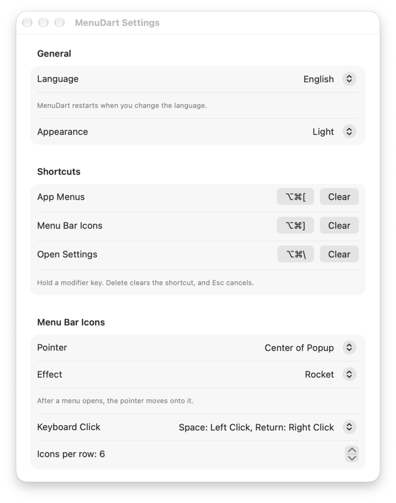

# MenuDart

**화면에 다 들어가지 않는 앱 메뉴와 메뉴 막대 아이콘까지, 팝업 하나로 모두 확인하세요.**

[English](README.md) | 한국어

스크린샷과 데모는 영어 화면으로 찍었습니다. 앱은 한국어를 포함한 11개 언어를 지원합니다.

## MenuDart를 만든 이유

맥북처럼 화면이 작으면 메뉴 막대는 금방 자리가 부족해집니다. 앱 메뉴가 전부 들어가지 않고, 실행 중인 앱이 많으면 메뉴 막대 아이콘이 넘쳐서 일부가 가려집니다. 노치가 있으면 더 심해집니다.

  

제 맥북의 메뉴 막대입니다. 메뉴 막대 아이콘은 18개인데 보이는 것은 이 몇 개뿐이고, 나머지는 macOS가 « 버튼 뒤로 접어 둡니다.

저는 이 앱을 만든 개발자입니다. 다른 메뉴 막대 아이콘 관리 앱을 쓰고 있었는데, macOS 27 Golden Gate로 업데이트한 뒤부터 동작이 이상해졌습니다. 그래서 접근 방식을 바꿔 직접 만들었습니다. 메뉴 막대 안에서 항목을 재배치하거나 숨기는 대신, 메뉴와 아이콘을 팝업으로 보여 줍니다. 메뉴 막대가 항목을 어떻게 배치하는지와 무관하게 동작합니다.

아이콘의 메뉴 자체를 더 편한 위치에 띄우고 싶었지만, 안정적으로 동작하는 방법을 찾지 못했습니다. 그래서 MenuDart는 메뉴가 원래 열리는 자리에 그대로 열리게 두고, 대신 포인터를 그 메뉴 위로 옮겨 줍니다.

## 데모 영상

50초 영상입니다(화면은 영어). 비좁은 맥북 메뉴 막대와 넓은 울트라와이드 모니터, 단축키 두 개, 그리고 고른 아이콘의 메뉴까지 포인터를 날려 주는 다트를 보여 줍니다.

  

<a href="https://youtu.be/BC-k86lHgMM">▶ YouTube에서 데모 보기</a>

## 주요 기능

MenuDart는 전역 단축키로 두 가지 팝업을 엽니다. 메뉴 막대의 MenuDart 아이콘에서도 두 팝업을 열 수 있습니다.

### 앱 메뉴 팝업

현재 사용 중인 앱의 메뉴(Apple 메뉴, 파일, 편집 등)를 포인터 옆 팝업으로 보여 줍니다. 메뉴 제목이 메뉴 막대에 다 들어가지 않을 때도 사용할 수 있습니다.

  

  

- 하위 메뉴는 같은 자리에서 열립니다. 앱 아이콘이 붙은 이동 경로(예: TextEdit › Format › Font)로 현재 위치를 확인하고, 앞 단계로 바로 돌아갈 수 있습니다.
- 시스템 메뉴와 비슷한 모양이며, 비활성 항목과 구분선도 그대로 표시합니다. 같은 동작은 한 번만 나타납니다(Option 키 대체 항목은 숨깁니다).
- 팝업이 작업 중인 앱의 포커스를 가져가지 않으므로, 그 앱의 메뉴 막대가 그대로 유지됩니다.

### 메뉴 막대 아이콘

메뉴 막대 오른쪽의 아이콘(상태 항목과 메뉴 엑스트라, 제어 센터 항목 포함)을 격자 팝업으로 모아 보여 줍니다. 메뉴 막대가 붐벼서 숨겨졌거나 노치에 잘린 아이콘도 함께 보입니다.

  

- 방향키나 포인터로 아이콘을 고르면, MenuDart가 실제 아이콘을 대신 클릭합니다. 왼쪽 클릭과 오른쪽 클릭을 모두 지원합니다.
- 화면에 보이는 아이콘이 먼저 나오고, 시스템 아이콘은 메뉴 막대 순서를 따릅니다.
- 아이콘을 클릭해도 아무 변화가 없으면 팝업에 작은 안내 문구가 표시됩니다.

**포인터 이동 방식.** 아이콘을 고르면 그 아이콘의 메뉴는 여전히 메뉴 막대 아래 원래 위치에서 열립니다. MenuDart는 그 메뉴를 옮기지 않으며 팝업 안에 보여 주지도 않습니다. 대신 메뉴가 열리면 포인터를 그 메뉴 위로 옮겨, 화면 맨 위까지 직접 이동하지 않아도 되게 합니다. 이동하는 동안 보여 줄 포인터 효과는 로켓, 궤적, 다트, 또이(날아가는 고양이), 효과 없음 중에서 고를 수 있습니다.

  

## 키보드 사용법

**앱 메뉴 팝업**

| 키 | 동작 |
|---|---|
| <kbd>↑</kbd> / <kbd>↓</kbd> | 항목 선택 |
| <kbd>→</kbd> | 하위 메뉴 열기 |
| <kbd>←</kbd> | 이전 단계로 돌아가기 |
| <kbd>Return</kbd> 또는 <kbd>Space</kbd> | 항목 실행 |
| <kbd>Esc</kbd> | 닫기 |

**메뉴 막대 아이콘**

| 키 | 동작 |
|---|---|
| 방향키 | 아이콘 선택 |
| <kbd>Space</kbd> | 아이콘 왼쪽 클릭 |
| <kbd>Return</kbd> | 아이콘 오른쪽 클릭 |
| <kbd>Esc</kbd> | 닫기 |

Space와 Return의 클릭 방식은 설정에서 서로 바꿀 수 있습니다. 두 팝업 모두 포인터로도 조작할 수 있습니다.

## 주요 설정

  

- **단축키.** 처음에는 지정된 단축키가 없습니다. 시작 가이드에서 기본값을 한 번에 적용할 수 있습니다. 앱 메뉴 팝업은 <kbd>⌥</kbd><kbd>⌘</kbd><kbd>[</kbd>, 메뉴 막대 아이콘은 <kbd>⌥</kbd><kbd>⌘</kbd><kbd>]</kbd>, 설정 열기는 선택 사항으로 <kbd>⌥</kbd><kbd>⌘</kbd><kbd>\\</kbd>입니다. 보조 키를 하나 이상 포함하는 조합이면 직접 지정할 수도 있습니다.
- **단축키 충돌 검사.** 다른 MenuDart 동작이나 macOS 시스템 단축키와 겹치면 경고하고, 옮기기, 그래도 등록하기, 취소 중에서 고를 수 있습니다.
- **메뉴 막대 아이콘 격자.** 한 줄에 표시할 아이콘 수(1~16개)와 팝업이 열릴 때 포인터가 놓일 위치(첫 번째 항목의 중앙 또는 팝업의 중앙)를 정할 수 있습니다.
- **포인터 효과.** 로켓, 궤적, 다트, 또이(날아가는 고양이), 효과 없음 중에서 고릅니다.
- **모양.** 시스템, 일반, 다크 중에서 고릅니다. macOS 26 이상에서는 팝업에 Liquid Glass(반투명 유리 효과)가 자동으로 적용됩니다.
- **언어.** 영어, 한국어, 일본어, 중국어(간체·번체), 포르투갈어(브라질), 스페인어, 힌디어, 이탈리아어, 독일어, 프랑스어를 지원합니다. 언어를 바꾸면 앱이 다시 시작됩니다.

## 요구 사항과 권한

- macOS 14.0 이상
- 유니버설 앱(Apple 실리콘, Intel 모두 지원)

| 권한 | 필수 여부 | 사용 목적 | 허용하지 않으면 |
|---|---|---|---|
| 손쉬운 사용 | 필수 | 앞에 있는 앱의 메뉴를 읽고, 메뉴 막대 아이콘을 클릭 | 두 팝업 모두 동작하지 않음 |
| 화면 기록 | 권장(선택) | 격자에 실제 메뉴 막대 아이콘 이미지를 표시 | 격자에 각 앱의 아이콘이 대신 표시됨 |

MenuDart는 팝업에 표시하는 메뉴 막대 아이콘만 캡처합니다. 캡처한 이미지는 저장하거나 외부로 보내지 않습니다. MenuDart는 사용자의 데이터를 수집하거나 전송하지 않습니다. 유일한 네트워크 요청은 업데이트 확인이며, 이때 업데이트 정보를 가져오기 위해 GitHub에 접속합니다.

처음 실행하면 시작 가이드가 권한과 단축키 설정을 단계별로 안내합니다. 약 2분이 걸립니다.

## 설치

1. [Releases](https://github.com/studiojin-dev/MenuDart-Public/releases)에서 최신 `MenuDart-x.y.z.dmg`를 내려받습니다.
2. `.dmg`를 열고 MenuDart를 응용 프로그램 폴더로 끌어다 놓습니다.
3. MenuDart를 실행하고 시작 가이드를 따라 설정합니다.

MenuDart는 Developer ID로 서명되어 있고 Apple의 공증을 받았습니다. Mac App Store가 아니라 이 저장소에서 직접 배포합니다. 업데이트는 메뉴 막대의 MenuDart 아이콘에서 **업데이트 확인…** 을 선택하면 됩니다.

## 자주 묻는 질문

### 손쉬운 사용 권한은 어떻게 허용하나요?

시스템 설정 › 개인정보 보호 및 보안 › 손쉬운 사용에서 MenuDart를 켭니다. 처음 실행할 때 시작 가이드가 이 과정을 안내합니다. 손쉬운 사용은 두 팝업 모두에 필요한 필수 권한입니다.

### 화면 기록 권한은 어떻게 허용하나요?

시스템 설정 › 개인정보 보호 및 보안 › 화면 및 시스템 오디오 녹음에서 MenuDart를 켭니다. 변경 사항은 앱을 다시 시작해야 적용되므로 **허용한 뒤에는 MenuDart를 다시 시작하세요.**

스위치는 켜져 있는데도 MenuDart에 "필요함"으로 표시된다면, 설정 › 권한 › 시작 가이드를 열고 **초기화 후 다시 요청**을 선택하세요.

### "확인되지 않은 개발자" 경고가 뜹니다. 안전한가요?

MenuDart는 Developer ID로 서명되어 있고 Apple의 공증을 받았으므로 보통은 문제없이 열립니다. 그래도 macOS가 실행을 막는다면 시스템 설정 › 개인정보 보호 및 보안에서 **그래도 열기**를 선택하세요. 또한 앱을 공식 [Releases](https://github.com/studiojin-dev/MenuDart-Public/releases) 페이지에서 내려받았는지 확인하세요.

### 지원하는 macOS 버전은 무엇인가요?

macOS 14.0 이상이며, Apple 실리콘과 Intel Mac 모두에서 동작합니다.

### 아이콘의 메뉴가 여전히 화면 맨 위에서 열립니다. 버그인가요?

버그가 아닙니다. 아이콘의 메뉴는 해당 앱과 macOS가 정한 자리에 열리며, MenuDart는 그 위치를 바꾸지 않습니다. 대신 메뉴가 열리면 포인터를 그 위로 옮겨 주기 때문에 직접 찾아갈 필요가 없습니다.

### MenuDart가 메뉴 막대 아이콘을 숨기거나 재배치하나요?

아닙니다. MenuDart는 메뉴 막대를 전혀 바꾸지 않습니다. 메뉴 막대에 있는 항목을 팝업으로 보여 줄 뿐입니다.

## 지원

버그를 발견했거나 궁금한 점이 있다면 [GitHub Issues](https://github.com/studiojin-dev/MenuDart-Public/issues)에 남겨 주세요. macOS 버전과 MenuDart 버전을 함께 적어 주시면 도움이 됩니다.

## 사용권 계약

MenuDart를 사용하려면 [최종 사용자 사용권 계약](EULA.ko.md)([English](EULA.md))에 동의해야 합니다. 처음 실행할 때 동의를 받습니다. 구매 전에 14일 무료 체험을 제공하므로 단순 변심에 의한 환불은 되지 않으며, MenuDart가 안내된 대로 동작하지 않는 경우의 환불은 계약 제7조를 따릅니다.

## 개인정보처리방침

MenuDart에는 회원 가입, 이용 분석, 광고, 행동 추적, 쿠키가 없습니다. 앱 메뉴와 메뉴 막대 아이콘은 Mac 안에서만 읽고 외부로 보내지 않습니다. 인터넷은 업데이트 확인, 라이선스 확인, 구매 전 할인 행사 확인에만 사용합니다. 자세한 내용은 [개인정보처리방침](PRIVACY.ko.md)([English](PRIVACY.md))을 참고하세요.

## 사업자 정보

상호: 스튜디오진(Studiojin) · 대표자: 김정진  
사업자등록번호: 730-50-01333 · 통신판매업 신고번호: 2026-화성병점-0744  
사업장 소재지: 경기도 화성시 병점구 영통로 59, 4층 407호 B16호(반월동, 현대프라자)  
이메일: support@studiojin.dev

---

© 2026 Studiojin
